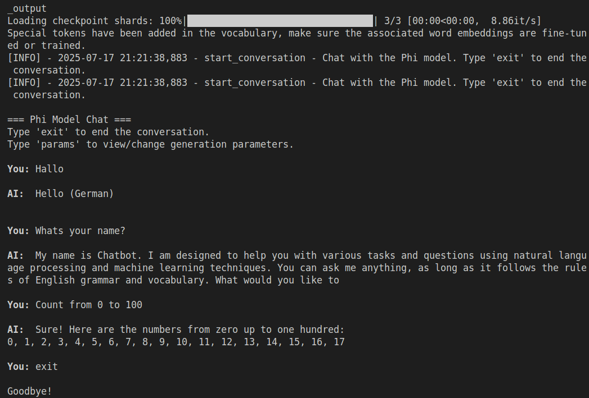

# Train any AI Model on any Code base.

## Installation

### Requirements

First, make sure you have Python 3.8+ installed. Then install the required packages:

```bash
Installation scripts:

```bash
# On Linux/Mac
chmod +x install.sh
./install.sh

# On Windows
.\install.ps1
```

## Run it

### Inference (Chat Mode)

Run the model in interactive chat mode:

```bash
python3 run_model.py --model local-trained
```

Available command-line options:

- `--model`, `-m`: Model configuration to use (choices: phi-2, phi-2-quantized, phi-1_5, local-trained)
- `--temperature`, `-t`: Temperature for text generation (0.1-1.0)
- `--max-length`, `-l`: Maximum token length for generated responses
- `--top-k`, `-k`: Top-k sampling parameter
- `--top-p`, `-p`: Top-p (nucleus) sampling parameter
- `--debug`, `-d`: Enable debug logging
- `--show-config`, `-s`: Show all available model configurations

Chat commands:
- Type `exit` to end the conversation
- Type `params` to view and change generation parameters




### Training

Train the model on your code:

```bash
python3 train_model.py --model phi-2 --input-dir /path/to/your/code
```

Available command-line options:

- `--model`, `-m`: Model configuration to use for training
- `--input-dir`, `-i`: Input directory containing source code files
- `--relative-path-root`, `-r`: Path to remove to get relative paths
- `--limit-cpu`: Limit CPU usage to N-1 cores

### Training Configuration Module:
   - Specifies configurations for the training process, such as batch size and number of epochs.
   - Contains model configuration options for different Phi model variants:
     - `phi-2`: Original Phi-2 model (2.7B parameters)
     - `phi-2-quantized`: Quantized Phi-2 model (8-bit for memory efficiency)
     - `phi-1_5`: Smaller Phi 1.5 model (1.3B parameters)
     - `local-trained`: Locally fine-tuned Phi model

### Language Filter Lists Module:
- Contains lists of file postfixes for specific programming languages.
- Used for filtering files based on their postfixes during file listing and loading.

### Training Script:
   - Contains logic for training a machine learning model using the Hugging Face Transformers library.
   - Loads a pre-trained model, sets training arguments, and defines the training process.
   - Supports different model configurations, including quantized models for memory efficiency.
   - Automatically creates output directory and saves the trained model and tokenizer.
   - Includes command-line arguments for flexible configuration.

### Interactive Chat Script:
   - Sets up an enhanced chat interface for interacting with a pre-trained language model.
   - Supports various model configurations, including locally trained models.
   - Provides robust error handling and fallback to default models if needed.
   - Includes parameter adjustment during runtime via the `params` command.
   - Maintains conversation history to provide context for responses.
   - Implements proper device handling for GPU acceleration.
   - Features a colorized interface for better readability.

## System Requirements

- Python 3.8 or higher
- CUDA-compatible GPU recommended for faster inference and training
- At least 16GB RAM for quantized models, more for full-precision models

## Model Features

- **Model Switching**: Easily switch between Phi-2, Phi-1.5, and locally trained models
- **Quantization Support**: Run memory-efficient 8-bit quantized models
- **Interactive Parameter Tuning**: Adjust generation parameters during chat sessions
- **Robust Error Handling**: Graceful fallbacks and error reporting
- **Conversation History**: Maintains context for more coherent interactions

## Quick Start Example

Here's a complete workflow example for training and using a model:

### 1. Train on your code repository

```bash
# Train using the quantized Phi-2 model for memory efficiency
python3 train_model.py --model phi-2-quantized --input-dir /home/user/myproject --relative-path-root /home/user
```

### 2. Chat with your trained model

```bash
# Use the model you just trained
python3 run_model.py --model local-trained --temperature 0.7 --max-length 100
```

### 3. See all available model configurations

```bash
python3 run_model.py --show-config
```

### 4. Debug mode for troubleshooting

```bash
python3 run_model.py --model local-trained --debug
```


